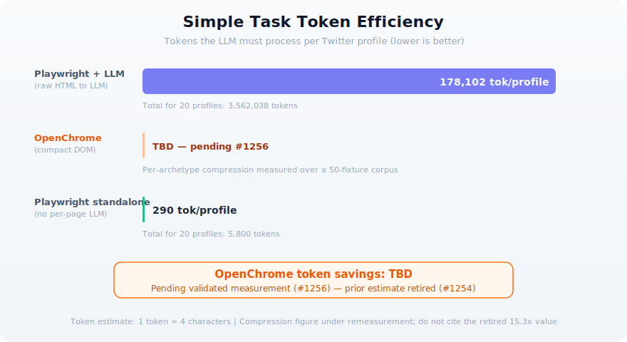

<p align="center">
  
</p>

<h1 align="center">OpenChrome</h1>

<p align="center">
  <b>Harness-Engineered Browser Automation</b><br>
  The MCP server that guides AI agents.
</p>

<p align="center">
  <a href="https://www.npmjs.com/package/openchrome-mcp"></a>
  <a href="https://github.com/shaun0927/openchrome/releases/latest"></a>
  <a href="https://github.com/shaun0927/openchrome/releases/latest"></a>
  <a href="https://opensource.org/licenses/MIT"></a>
  <a href="https://mseep.ai/app/shaun0927-openchrome"></a>
</p>

<p align="center">
  
</p>

<p align="center">
  
</p>

### How OpenChrome compares

|  | OpenChrome | Playwright MCP | Chrome DevTools MCP | Vercel agent-browser |
|---|:---:|:---:|:---:|:---:|
| **Architecture** | MCP → CDP (direct) | MCP → Playwright → CDP | MCP → Puppeteer → CDP | CLI → Daemon → Playwright → CDP |
| **RAM (20 parallel)** | **~300 MB** | ~5 GB+ | impractical | impractical |
| **Bot detection** | **invisible** (real Chrome) | detected (TLS fingerprint) | detected (CDP signals) | detected (local) / cloud only |
| **Chrome login reuse** | **built-in** | extension mode only | manual | manual state files |
| **LLM hang prevention** | **hint engine** (30+ rules) | none | none | error rewrite (5 patterns) |
| **Reliability mechanisms** | **49** (8-layer defense) | ~3 | ~3 | ~5 |
| **Token compression** | **15x** (DOM serializer) | none | none | none |
| **Outcome classification** | **yes** (DOM delta) | none | none | none |
| **Cross-session learning** | **yes** (domain memory) | none | none | none |
| **Circuit breaker** | **3-level** | none | none | none |
| **Shadow DOM** | **all types** (open + closed) | open only | invisible | invisible |
| **MCP native** | **yes** | yes | yes | no (CLI only) |
| **Parallel sessions** | **1 Chrome, N tabs** | N browsers | manual tabs | N daemons |

> **tl;dr** — OpenChrome talks directly to Chrome via CDP with zero middleware, reuses your real login sessions, and is the only browser MCP server with **harness engineering** — 27 intelligent subsystems that guide, protect, and optimize the AI agent at every step.

---

## What is OpenChrome?

Imagine **20+ parallel Playwright sessions** — but already logged in to everything, invisible to bot detection, and sharing one Chrome process at 300MB. That's OpenChrome.

Search across 20 sites simultaneously. Crawl authenticated dashboards in seconds. Debug production UIs with real user sessions. Connect to [OpenClaw](https://github.com/openclaw/openclaw) and give your AI agent browser superpowers across Telegram, Discord, or any chat platform.

```
You: oc compare "AirPods Pro" prices across Amazon, eBay, Walmart,
     Best Buy, Target, Costco, B&H, Newegg — find the lowest

AI:  [8 parallel workers, all sites simultaneously]
     Best Buy:  $179 ← lowest (sale)
     Amazon:    $189
     Costco:    $194 (members)
     ...
     Time: 2.8s | All prices from live pages, already logged in.
```

| | Traditional | OpenChrome |
|---|:---:|:---:|
| **5-site task** | ~250s (login each) | **~3s** (parallel) |
| **Memory** | ~2.5 GB (5 browsers) | **~300 MB** (1 Chrome) |
| **Auth** | Every time | **Never** |
| **Bot detection** | Flagged | **Invisible** |

---

## Harness-Engineered, Not Just Automated

Traditional browser automation exposes raw APIs. When the AI agent fails, it's on its own — burning tokens guessing, retrying, and wandering. **Harness engineering** means the tool itself wraps intelligence around those APIs: preventing mistakes, recovering from errors, and guiding the agent toward efficient behavior.

The bottleneck in browser automation isn't the browser — it's the **LLM thinking between each step**. Every tool call costs 5–15 seconds of inference time. When an AI agent guesses wrong, it doesn't just fail — it spends another 10 seconds thinking about why, then another 10 seconds trying something else.

```
Playwright agent checking prices on 5 sites:

  Site 1:  launch browser           3s
           navigate                  2s
           ⚡ bot detection          LLM thinks... 12s → retry with UA
           ⚡ CAPTCHA                LLM thinks... 10s → stuck, skip
           navigate to login         2s
           ⚡ no session             LLM thinks... 12s → fill credentials
           2FA prompt               LLM thinks... 10s → stuck
           ...
           finally reaches product   after ~20 LLM calls, ~4 minutes

  × 5 sites, sequential  =  ~100 LLM calls,  ~20 minutes,  ~$2.00

  Actual work: 5 calls.  Wasted on wandering: 95 calls.
```

OpenChrome eliminates this entirely — your Chrome is already logged in, and the hint engine corrects mistakes before they cascade:

```
OpenChrome agent checking prices on 5 sites:

  All 5 sites in parallel:
    navigate (already authenticated)     1s
    read prices                          2s
    ⚡ stale ref on one site
      └─ Hint: "Use read_page for fresh refs"    ← no guessing
    read_page → done                     1s

  = ~20 LLM calls,  ~15 seconds,  ~$0.40
```

The hint engine watches every tool call across 9 categories — error recovery, blocking page detection, composite suggestions, repetition detection, sequence detection, pagination detection, learned patterns, success guidance, and setup hints. When it sees the same error→recovery pattern 3+ times, it promotes it to a permanent rule across sessions via the Pattern Learner.

| | Playwright | OpenChrome | Savings |
|---|---|---|---|
| **LLM calls** | ~100 | ~20 | **80% fewer** |
| **Wall time** | ~20 min | ~15 sec | **80x faster** |
| **Token cost** | ~$2.00 | ~$0.40 | **5x cheaper** |
| **Wasted calls** | ~95% | ~0% | |

### 27 Harness Features Across 7 Categories

OpenChrome isn't just a browser API — it's an intelligent harness with 27 subsystems that work together:

| Category | Key Features | What It Does |
|----------|-------------|--------------|
| **Guidance** | Hint Engine (30+ rules, 9 types), Progress Tracker, Usage Guide | Prevents mistakes before they cascade |
| **Resilience** | Ralph Engine (7-strategy waterfall), Auto-Reconnect, Ref Self-Healing | Recovers from failures automatically |
| **Protection** | 3-Level Circuit Breaker, Rate Limiter, Domain Guard | Stops runaway token waste |
| **Feedback** | Outcome Classifier, DOM Delta, Visual Summary, Hit Detection | Reports what *actually* happened |
| **Learning** | Pattern Learner, Strategy Learner, Domain Memory | Gets smarter across sessions |
| **Optimization** | DOM Mode (15x compression), Adaptive Screenshot, Snapshot Delta | Minimizes token consumption |
| **Detection** | Auth Redirect Detection, Blocking Page, Pagination Detector | Identifies situations early |

<details>
<summary>Feature highlights</summary>

**Hint Engine** — 30+ rules across 9 categories (error recovery, blocking page detection, repetition loops, pagination, composite suggestions, sequence optimization, learned patterns, success guidance, setup hints). Escalates from `info` → `warning` → `critical` as patterns repeat. The Progress Tracker detects stuck agents within 3-5 tool calls.

**Ralph Engine** — When an interaction fails, Ralph automatically tries 7 strategies in sequence: AX tree click → CSS discovery → CDP coordinate dispatch → JS injection → Keyboard navigation → Raw CDP mouse events → Human-in-the-loop escalation. Each attempt is classified by the Outcome Classifier (SUCCESS / SILENT_CLICK / WRONG_ELEMENT).

**3-Level Circuit Breaker** — Element level (3 failures → skip, 2min reset), Page level (5 distinct failures → suggest reload), Global level (10 failures in 5min → pause all). Prevents agents from burning tokens on permanently broken elements.

**Pattern Learner** — When a hint rule misses, the learner observes the next 3 tool calls. If a different tool succeeds, it records the error→recovery correlation. After 3 occurrences at 60%+ confidence, it promotes the pattern to a permanent rule that fires in future sessions.

**DOM Mode** — Serializes the full DOM into a compact text format: strips SCRIPT/STYLE/SVG, keeps only 18 actionable attributes, deduplicates repetitive siblings, collapses nested wrapper chains. **Benchmarked: ~12K tokens vs ~180K tokens** for the same page (15x compression).

</details>

---

## Desktop App (Beta)

<p align="center">
  
  
  
</p>

OpenChrome is also available as a **desktop app** — a one-click installer that runs the MCP server locally without requiring Node.js, npm, or any command-line setup. Designed for non-developers who want browser automation without the terminal.

> **Note:** These are unsigned builds. See [installation notes](#installation-notes) below.

### Download

| Platform | Download |
|----------|----------|
| macOS (Apple Silicon) | [OpenChrome_0.1.0_aarch64.dmg](https://github.com/shaun0927/openchrome/releases/download/desktop-v0.1.0/OpenChrome_0.1.0_aarch64.dmg) |
| macOS (Intel) | [OpenChrome_0.1.0_x64.dmg](https://github.com/shaun0927/openchrome/releases/download/desktop-v0.1.0/OpenChrome_0.1.0_x64.dmg) |
| Windows (EXE) | [OpenChrome_0.1.0_x64-setup.exe](https://github.com/shaun0927/openchrome/releases/download/desktop-v0.1.0/OpenChrome_0.1.0_x64-setup.exe) |
| Windows (MSI) | [OpenChrome_0.1.0_x64_en-US.msi](https://github.com/shaun0927/openchrome/releases/download/desktop-v0.1.0/OpenChrome_0.1.0_x64_en-US.msi) |
| Linux | Coming soon (deb/rpm available in [Releases](https://github.com/shaun0927/openchrome/releases/tag/desktop-v0.1.0)) |

### Get Started (non-developers)

1. **Download** the installer for your platform from the [Releases](https://github.com/shaun0927/openchrome/releases?q=desktop) page.
2. **Install** — open the `.dmg` / run the `.exe` installer / make the `.AppImage` executable and launch it.
3. **Connect** — the app starts the MCP server automatically. Point your MCP client (Claude, Cursor, etc.) to the local server address shown in the app.

### Installation Notes

**macOS:** The app is not notarized. On first launch, macOS will block it. To fix:
```bash
xattr -cr /Applications/OpenChrome.app
```
Or right-click the app → Open → Open.

**Windows:** SmartScreen will show "Windows protected your PC". Click "More info" → "Run anyway".

**Linux:** No additional steps needed. Download the AppImage, make it executable (`chmod +x`), and run.

> **Note:** The desktop app and the CLI (`openchrome-mcp` on npm) are separate distributions with independent version numbers. You do not need both — use whichever fits your workflow. See [`desktop/RELEASING.md`](desktop/RELEASING.md) for the desktop release process.

---

## Quick Start

**Claude Code**
```bash
npm install -g openchrome-mcp
openchrome setup
```

**Codex CLI**
```bash
npm install -g openchrome-mcp
openchrome setup --client codex
```

One command. Configures the MCP server for the selected client.
Restart your MCP client after setup completes.

<details>
<summary>Manual config</summary>

**Claude Code:**
```bash
claude mcp add openchrome -- openchrome serve --auto-launch
```

**VS Code / Copilot** (`.vscode/mcp.json`):
```json
{
  "servers": {
    "openchrome": {
      "type": "stdio",
      "command": "openchrome",
      "args": ["serve", "--auto-launch"]
    }
  }
}
```

**Codex CLI** (`~/.codex/mcp.json`):
```json
{
  "mcpServers": {
    "openchrome": {
      "command": "openchrome",
      "args": ["serve", "--auto-launch"]
    }
  }
}
```

**Cursor / Windsurf / Other stdio MCP clients:**
```json
{
  "mcpServers": {
    "openchrome": {
      "command": "openchrome",
      "args": ["serve", "--auto-launch"]
    }
  }
}
```

To update the CLI later and refresh your MCP client configuration, run:
```bash
openchrome update
```

</details>

---

## Examples

**Parallel monitoring:**
```
oc screenshot AWS billing, GCP console, Stripe, and Datadog — all at once
→ 4 workers, 3.1s, already authenticated everywhere
```

**Multi-account:**
```
oc check orders on personal and business Amazon accounts simultaneously
→ 2 workers, isolated sessions, same site different accounts
```

**Competitive intelligence:**
```
oc compare prices for "AirPods Pro" across Amazon, eBay, Walmart, Best Buy
→ 4 workers, 4 sites, 2.4s, works past bot detection
```

---

## 46 Tools

| Category | Tools |
|----------|-------|
| **Navigate & Interact** | `navigate`, `interact`, `fill_form`, `find`, `computer` |
| **Read & Extract** | `read_page`, `page_content`, `javascript_tool`, `selector_query`, `xpath_query` |
| **Environment** | `emulate_device`, `geolocation`, `user_agent`, `network` |
| **Storage & Debug** | `cookies`, `storage`, `console_capture`, `performance_metrics`, `request_intercept` |
| **Parallel Workflows** | `workflow_init`, `workflow_collect`, `worker_create`, `batch_execute` |
| **Memory** | `memory_record`, `memory_query`, `memory_validate` |

<details>
<summary>Full tool list (46)</summary>

`navigate` `interact` `computer` `read_page` `find` `form_input` `fill_form` `javascript_tool` `page_reload` `page_content` `page_pdf` `wait_for` `user_agent` `geolocation` `emulate_device` `network` `selector_query` `xpath_query` `cookies` `storage` `console_capture` `performance_metrics` `request_intercept` `drag_drop` `file_upload` `http_auth` `worker_create` `worker_list` `worker_update` `worker_complete` `worker_delete` `tabs_create` `tabs_context` `tabs_close` `workflow_init` `workflow_status` `workflow_collect` `workflow_collect_partial` `workflow_cleanup` `execute_plan` `batch_execute` `lightweight_scroll` `memory_record` `memory_query` `memory_validate` `oc_stop`

</details>

---

## CLI

```bash
openchrome setup                    # Auto-configure
openchrome serve --auto-launch      # Start server
openchrome serve --headless-shell   # Headless mode
openchrome doctor                   # Diagnose issues
openchrome update                   # Update CLI
```

---

## Cross-Platform

| Platform | Status |
|----------|--------|
| **macOS** | Full support |
| **Windows** | Full support (taskkill process cleanup) |
| **Linux** | Full support (Snap paths, `CHROME_PATH` env, `--no-sandbox` for CI) |

---

## DOM Mode (Token Efficient)

`read_page` supports three output modes:

| Mode | Output | Tokens | Use Case |
|------|--------|--------|----------|
| `ax` (default) | Accessibility tree with `ref_N` IDs | Baseline | Screen readers, semantic analysis |
| `dom` | Compact DOM with `backendNodeId` | **~5-10x fewer** | Click, fill, extract — most tasks |
| `css` | CSS diagnostic info (variables, computed styles, framework detection) | Minimal | Debugging styles, Tailwind detection |

**DOM mode example:**
```
read_page tabId="tab1" mode="dom"

[page_stats] url: https://example.com | title: Example | scroll: 0,0 | viewport: 1920x1080

[142]<input type="search" placeholder="Search..." aria-label="Search"/> ★
[156]<button type="submit"/>Search ★
[289]<a href="/home"/>Home ★
[352]<h1/>Welcome to Example
```

DOM mode outputs `[backendNodeId]` as stable identifiers — they persist for the lifetime of the DOM node, unlike `ref_N` IDs which are cleared on each AX-mode `read_page` call.

---

## Stable Selectors

Action tools that accept a `ref` parameter (`form_input`, `computer`, etc.) support three identifier formats:

| Format | Example | Source |
|--------|---------|--------|
| `ref_N` | `ref_5` | From `read_page` AX mode (ephemeral) |
| Raw integer | `142` | From `read_page` DOM mode (stable) |
| `node_N` | `node_142` | Explicit prefix form (stable) |

**Backward compatible** — existing `ref_N` workflows work unchanged. DOM mode's `backendNodeId` eliminates "ref not found" errors caused by stale references.

---

## Session Persistence

Headless mode (`--headless-shell`) doesn't persist cookies across restarts. Enable storage state persistence to maintain authenticated sessions:

```bash
oc serve --persist-storage                         # Enable persistence
oc serve --persist-storage --storage-dir ./state    # Custom directory
```

Cookies and localStorage are saved atomically every 30 seconds and restored on session creation.

---

## Anti-Bot & Turnstile Support

OpenChrome includes built-in defenses against Cloudflare Turnstile and similar anti-bot systems. See [Turnstile Guide](docs/turnstile-guide.md) for details.

### 3-Tier Auto-Fallback for CDN/WAF Blocks

When a navigation is blocked by CDN/WAF systems (Akamai, Cloudflare, etc.), OpenChrome automatically escalates through three tiers:

| Tier | Mode | What It Bypasses |
|------|------|-----------------|
| 1 | Headless Chrome | Normal navigation — works for most sites |
| 2 | Stealth + Headless | JS-level anti-bot (PerimeterX, Turnstile, basic fingerprinting) |
| 3 | **Headed Chrome** | TLS/UA-level blocking (Akamai CDN, network security filters) |

Tier 3 launches a real headed Chrome window with a genuine user-agent (`Chrome/...` instead of `HeadlessChrome/...`) and a different TLS fingerprint, bypassing binary-level detection that no JavaScript injection can fix.

**Parameters:**
- `autoFallback: false` — disable automatic CDN/WAF retry. This does not log in for you or bypass normal authentication redirects.
- `headed: true` — skip directly to headed Chrome for user-visible login, 2FA, CAPTCHA, or sites that require a real browser window.
- `stealth: true` — use stealth mode (Tier 2) explicitly.

**Authentication note:** Auto-fallback is for detected CDN/WAF blocking. If a protected app redirects from the requested URL to a same-site login page, treat that as an authentication handoff: retry with `headed: true` and the same persistent profile, let the user complete login, then verify whether headless can reuse that profile state.

**Environment:** Tier 3 requires a display (macOS/Windows desktop, or Linux with `$DISPLAY`). In server/container environments without a display, Tier 3 is gracefully skipped.

### Known Limitations

- **CAPTCHA-protected sites (e.g., Reddit):** Auto-fallback correctly detects and escalates through all tiers, but sites that serve CAPTCHA challenges ("Prove your humanity") to all automated clients — regardless of headless/headed mode — require human interaction to solve. This is beyond auto-fallback's scope, which targets CDN/WAF network-level blocking (TLS fingerprint, user-agent detection), not interactive CAPTCHA challenges.

---

## FAQ: Comparison with Other Browser MCPs

Common questions from users evaluating OpenChrome against Chrome DevTools MCP, Firefox DevTools MCP, and similar tools (see [#612](https://github.com/shaun0927/openchrome/issues/612)).

### Can multiple MCP clients share tabs safely?

**Yes — tabs cannot clobber each other across clients.**

OpenChrome identifies every tab by its CDP `targetId` — a stable, browser-assigned string — not by a visible 1/2/3 index. On top of stable IDs, two layers of isolation are specifically designed for multi-client scenarios:

- **`workerId`** — logical tab groups per client or parallel lane. A new tab under one `workerId` is invisible to another and never replaces one.
- **`profileDirectory`** — launches a fully separate Chrome instance bound to that profile, giving OS-level cookie / storage / extension isolation.

If client A opens five tabs and client B opens five tabs, all ten `tabId`s are distinct and stable; a new tab from A can never displace B's tab #3.

### How do I handle sites that require interactive login (password, 2FA, CAPTCHA)?

Use two mechanisms, but keep their guarantees separate:

**1. Persistent-profile headless — reuse an already-authenticated profile.**
Point OpenChrome at a persistent `userDataDir` (+ optional `profileDirectory`) so cookies / `localStorage` / IndexedDB can survive across runs. If that persistent profile already contains a valid session, subsequent **headless** runs stay logged in until the site invalidates the session.

**2. Headed-by-default / headed fallback — let the user complete an interactive step.**
Since #657 the launcher runs headed by default, so first-time login, 2FA, CAPTCHA, and WebAuthn can use a real visible window without extra flags. CI / Docker users opt into headless via `--headless` or `OPENCHROME_HEADLESS=1` after their persistent profile is bootstrapped. When a Tier-1/Tier-2 headless attempt is blocked by a CDN/WAF, OpenChrome can also lazy-launch a separate headed Chrome on a different debug port and register the headed page back into the same logical session.

**Important:** a headed tab being authenticated does not automatically prove that a new headless tab can reuse the session after the headed tab is closed. Sites differ in how they bind cookies, storage, browser fingerprints, and session freshness. Always verify the handoff by closing/restarting the headed path you plan to stop using and navigating headless to the protected URL with the same persistent profile.

**Recommended flow:**
1. Start with the persistent `userDataDir` / `profileDirectory` you intend to keep using.
2. Navigate to the protected URL. If it resolves to `/login` or another auth page, do not keep retrying unauthenticated headless navigation.
3. Use the visible headed window (default) or navigate with `headed: true` and the same profile context, then let the user complete login/2FA/CAPTCHA.
4. Retry the protected URL with the same profile in the mode you intend to automate.
5. If headless still lands on the login page, keep the headed tab open for that site or reconfigure persistence; do not assume the headed auth state transferred.

### Does OpenChrome steal focus with popup windows?

**No — the "recurring popup interruptions" problem does not occur in OpenChrome.**

The headed-browser focus-stealing pattern that users encounter with some MCP servers (cross-Space jumps on macOS, un-minimizable popups, per-tool-call window raises) comes from designs where the MCP drives a user-visible browser and creates OS windows as it works. OpenChrome is architected differently:

- **`tabs_create` opens a tab, not an OS window.** New tabs are created via CDP inside the already-running Chrome, and OpenChrome never calls `page.bringToFront()` anywhere in the codebase.
- **No per-call window raises.** Each navigation/click/tool call runs against the existing window without `bringToFront()`, `focus()`, or any other stealing primitive. After the initial Chrome launch you keep working in your other apps without interruption.
- **One Chrome per server lifetime.** Auto-launch creates Chrome **once** at startup and reuses it for every later tool call — no popup-per-action loop.
- **Headless opt-in available.** For CI/server use, `--headless` or `OPENCHROME_HEADLESS=1` runs without any window at all. The default is headed since #657 because headless mode is materially more prone to silent hangs and login failures on real-world sites.

The only scenario in which a focus grab can happen is the very first Chrome launch — not one per tool call, never one per tab.

---

## Benchmarks

Measure token efficiency and parallel performance:

```bash
npm run benchmark                                    # Stub mode: AX vs DOM token efficiency (interactive)
npm run benchmark:ci                                 # Stub mode: AX vs DOM with JSON + regression detection
npm run benchmark -- --mode real                     # Real mode: actual MCP server (requires Chrome)
npx ts-node tests/benchmark/run-parallel.ts          # Stub mode: all parallel benchmark categories
npx ts-node tests/benchmark/run-parallel.ts --mode real --category batch-js --runs 1  # Real mode
npx ts-node tests/benchmark/run-parallel.ts --mode real --category realworld --runs 1  # Real-world benchmarks
```

By default, benchmarks run in **stub mode** — measuring protocol correctness and tool-call counts with mock responses. Use `--mode real` to spawn an actual MCP server subprocess and measure real performance (requires Chrome to be available).

**Parallel benchmark categories:**

| Category | What It Measures |
|----------|-----------------|
| Multi-step interaction | Form fill + click sequences across N parallel pages |
| Batch JS execution | N × `javascript_tool` vs 1 × `batch_execute` |
| Compiled plan execution | Sequential agent tool calls vs single `execute_plan` |
| Streaming collection | Blocking vs `workflow_collect_partial` |
| Init overhead | Sequential `tabs_create` vs batch `workflow_init` |
| Fault tolerance | Circuit breaker recovery speed |
| Scalability curve | Speedup efficiency at 1–50x concurrency |
| **Real-world** | Multi-site crawl, heavy JS, pipeline, scalability with public websites (`httpbin.org`, `jsonplaceholder`, `example.com`) — NOT included in `all`, requires network |

---

## Server / Headless Deployment

OpenChrome works on servers and in CI/CD pipelines without Chrome login. All 46 tools function with unauthenticated Chrome — navigation, scraping, screenshots, form filling, and parallel workflows all work in clean sessions.

### Quick start

```bash
# Single flag for optimal server defaults
openchrome serve --server-mode
```

`--server-mode` automatically sets:
- Auto-launches Chrome in headless mode
- Skips cookie bridge scanning (~5s faster per page creation)
- Optimal defaults for server environments

### What works without login

| Category | Tools |
|----------|-------|
| **Navigation & scraping** | `navigate`, `read_page`, `page_content`, `javascript_tool` |
| **Interaction** | `interact`, `fill_form`, `drag_drop`, `file_upload` |
| **Parallel workflows** | `workflow_init` with multiple workers, `batch_execute` |
| **Screenshots & PDF** | `computer(screenshot)`, `page_pdf` |
| **Network & performance** | `request_intercept`, `performance_metrics`, `console_capture` |

### Important: MCP client required

OpenChrome is an MCP server — it responds to tool calls, not standalone scripts. Server-side usage requires an MCP client (e.g., Claude API, Claude Code, or a custom MCP client) to drive it:

```
MCP Client (LLM) → stdio → OpenChrome (--server-mode) → Chrome
```

For standalone scraping scripts without an LLM, use Playwright or Puppeteer directly.

### Docker

A production-ready `Dockerfile` is included in the repository:

```bash
docker build -t openchrome .
docker run openchrome
```

### Environment variables

| Variable | Description |
|----------|-------------|
| `CHROME_PATH` | Path to Chrome/Chromium binary (used by launcher) |
| `CHROME_BINARY` | Path to Chrome binary (used by `--chrome-binary` CLI flag) |
| `CHROME_USER_DATA_DIR` | Custom profile directory |
| `CI` | Detected automatically; adds `--no-sandbox` |
| `DOCKER` | Detected automatically; adds `--no-sandbox` |
| `OPENCHROME_PPID_WATCH` | Set to `0` to disable the parent-process watcher in stdio mode. Default: enabled. The watcher exits the server when its launching MCP-client parent dies, so abrupt parent termination (force-quit, `kill -9`, tmux teardown) does not orphan the openchrome process. HTTP and `both` transport modes ignore this flag — they remain daemon-capable. |
| `OPENCHROME_PPID_WATCH_INTERVAL_MS` | Polling interval for the parent watcher in milliseconds. Default: `2000`. Clamped to `[500, 60000]`. |
| `OPENCHROME_HEALTH_ENDPOINT` | Force-enable (`1`/`true`) or force-disable (`0`/`false`) the `/health` and `/metrics` HTTP listener. Default: on for `--transport http` / `both`, off for `--transport stdio`. Stdio-mode instances usually talk to a single MCP client over the pipe and do not need an external monitoring port; disabling it saves ~200-300 KB heap + one file descriptor per instance. Operators who run stdio under a supervisor can opt in with `OPENCHROME_HEALTH_ENDPOINT=1`; daemon-mode operators who run the health check externally can opt out with `OPENCHROME_HEALTH_ENDPOINT=0`. Invalid values (e.g. `yes`, `2`) fall through to the transport-mode default. |
| `OPENCHROME_HEADLESS` | Opt into headless Chrome from CI / Docker without `--headless`. Accepts `1`/`true`/`yes` (headless) or `0`/`false`/`no` (headed). Lower precedence than the CLI flag, higher than persisted config. Default since #657 is headed. |
| `OPENCHROME_WINDOW_SIZE` | Headed auto-launch window size as `width,height`, for example `1280,900`. Width and height must be positive integers. |
| `OPENCHROME_WINDOW_POSITION` | Headed auto-launch window position as `x,y`, for example `0,0` or `1920,0`. Coordinates may be negative. |
| `OPENCHROME_WINDOW_BOUNDS` | Headed auto-launch bounds as `x,y,width,height`. Overrides `OPENCHROME_WINDOW_SIZE` and `OPENCHROME_WINDOW_POSITION`. |
| `OPENCHROME_START_MAXIMIZED` | Set to `1`/`true`/`yes` to start headed Chrome maximized when no explicit bounds, size, or position is configured. |
| `OPENCHROME_FILE_UPLOAD_ROOTS` | Additional directories allowed for `file_upload`, separated with the platform path delimiter (`:` on POSIX, `;` on Windows). Defaults always include the server process current working directory and the temp upload directory. |
| `OPENCHROME_FILE_UPLOAD_TEMP_DIR` | Temp/upload directory allowed for `file_upload`. Default: `path.join(os.tmpdir(), 'openchrome-uploads')`. |

`file_upload` only accepts files whose resolved real path stays inside the server current working directory, the temp upload directory, or an explicit upload root. Add the narrowest possible root, for example `OPENCHROME_FILE_UPLOAD_ROOTS=/srv/openchrome/uploads`, rather than broad locations such as `$HOME`, browser profiles, SSH/GPG/cloud credential directories, or application config trees. Symlinks and `..` traversal are resolved with `realpath` before allowlist checks, so a symlink inside an allowed root that points outside the root is rejected. For untrusted clients, prefer staging files into `OPENCHROME_FILE_UPLOAD_TEMP_DIR` and upload from there.

### Individual flags

For fine-grained control, use individual flags instead of `--server-mode`:

```bash
openchrome serve \
  --auto-launch \
  --headless-shell \
  --port 9222
```

| Flag | Default | Description |
|------|---------|-------------|
| `--auto-launch` | `false` | Auto-launch Chrome if not running |
| `--headless` | `false` | Run Chrome headless. Also: `OPENCHROME_HEADLESS=1`. Default since #657 is headed. |
| `--headless-shell` | `false` | Use chrome-headless-shell binary |
| `--visible` | (deprecated) | No-op alias for headed; the new default is headed since #657. Will be removed in a future release. |
| `--window-size <width,height>` | `1280,900` headed | Set headed Chrome auto-launch size. CLI overrides env. |
| `--window-position <x,y>` | `0,0` headed | Set headed Chrome auto-launch position. CLI overrides env. |
| `--window-bounds <x,y,width,height>` | unset | Set headed Chrome auto-launch position and size together. Overrides size/position. |
| `--start-maximized` | `false` | Start headed Chrome maximized only when no explicit bounds, size, or position is set. |
| `--server-mode` | `false` | Compound flag for server deployment (forces `--headless` + auto-launch) |

Headed auto-launch defaults to `--window-position=0,0 --window-size=1280,900` so the first Chrome window lands predictably without maximizing. To place Chrome on the right side of a 1920px-wide primary display:

```bash
openchrome serve --auto-launch --window-bounds 1920,0,1280,900
```

To keep only a clipped strip visible on the right edge of the primary display:

```bash
openchrome serve --auto-launch --window-bounds 1720,0,1280,900
```

---

## Authentication

OpenChrome supports per-tenant API keys, JWT/OAuth, a legacy shared token, and an unauthenticated mode. See **[docs/auth.md](docs/auth.md)** for the full guide including quickstart, scope table, key rotation, revocation, and troubleshooting.

---

## Under the Hood: 8-Layer Reliability

OpenChrome has **49 distinct reliability mechanisms** across 8 defense layers — ensuring no single failure can hang the MCP server.

```
┌─────────────────────────────────────────────────────────────┐
│  Layer 7: MCP Gateway                                       │
│  Rate limiter · Tool timeout (120s) · Error recovery hints  │
├─────────────────────────────────────────────────────────────┤
│  Layer 6: Session Management                                │
│  TTL cleanup · Memory pressure · Target reconciliation      │
├─────────────────────────────────────────────────────────────┤
│  Layer 5: Request Queue                                     │
│  Per-session FIFO · Per-item timeout (120s)                 │
├─────────────────────────────────────────────────────────────┤
│  Layer 4: Circuit Breaker                                   │
│  Element (3 fails) · Page (5 fails) · Global (10/5min)     │
├─────────────────────────────────────────────────────────────┤
│  Layer 3: CDP Client                                        │
│  Adaptive heartbeat · Stale target guard · Page defenses    │
├─────────────────────────────────────────────────────────────┤
│  Layer 2: Reconnection Engine                               │
│  Auto-reconnect (5 retries) · Exponential backoff · Cookie  │
│  restore · Sleep/wake detection                             │
├─────────────────────────────────────────────────────────────┤
│  Layer 1: Self-Healing                                      │
│  Chrome watchdog · Tab health monitor · Event loop monitor  │
│  Disk monitor · Health endpoint (/health, /metrics)         │
├─────────────────────────────────────────────────────────────┤
│  Layer 0: Process Lifecycle                                 │
│  Graceful shutdown · Orphan cleanup · Atomic file writes    │
└─────────────────────────────────────────────────────────────┘
```

**32 configurable timeouts** cover every operation from CDP commands (15s) to tool execution (120s) to Chrome launch (60s). Every timeout is independently tunable via `src/config/defaults.ts`.

## Element Intelligence

Finding elements by natural language instead of CSS selectors:

```
"Submit button" → normalizeQuery → parseQueryForAX → AX Tree Resolution
                                                          │
                                                     match found?
                                                     /         \
                                                   yes          no
                                                    │            │
                                              [AX result]   CSS Fallback
                                                             + Shadow DOM
                                                             + Scoring
```

- **AX-first**: Uses Chrome's accessibility tree — framework-agnostic across React, Angular, Vue, Web Components
- **Cascading filter**: 4-level deterministic priority (exact role+name → role+contains → exact name → partial)
- **3-tier Shadow DOM**: Open roots (JS) + closed roots (CDP) + user-agent roots
- **Hit detection**: After clicking, reports what was actually hit + nearest interactive element
- **i18n**: Korean role keywords built-in (`"버튼"` → button, `"링크"` → link, `"드롭다운"` → combobox)

---

## Development

```bash
git clone https://github.com/shaun0927/openchrome.git
cd openchrome
npm install && npm run build && npm test
```

### Lint guardrails

Use `npm run lint -- --max-warnings=0` before submitting source changes. For
smaller PR checks, `npm run lint:changed -- --base origin/develop` lints only
changed `src/**/*.ts` files and also fails on warnings.

## License

MIT
